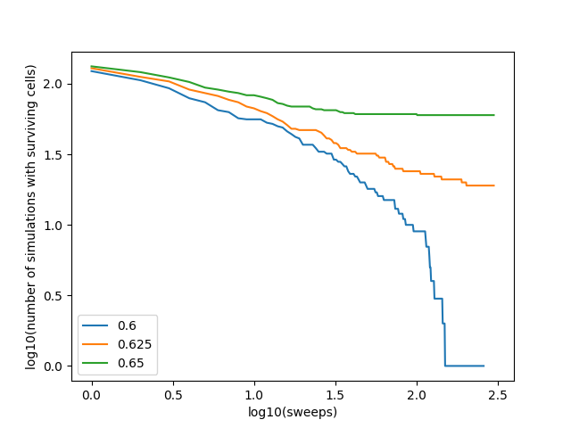

# Simple infection model

## Infection model laid out on a grid of cells. Cells can only have one of two states: infected or healthy. This problem was found in a past paper for the Modelling and Visualisation in Physics course (paper.pdf). The dynamics of the system were studied to find how the system behaved as the probabilities of cell death (p) and neighbour infection (1-p) were varied.

This is a log plot of survival versus number of sweeps/updates in simulation for three different values of p. This experiment showed that a phase change took place at p~0.625 as the system goes from always reaching an absorbing state to indefinite survival.

* IR.py contains the project code.